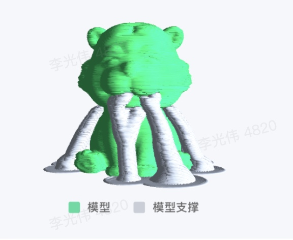

OrcaSlicer二次开发
一、项目简介
OrcaSlicer 是基于 BambuStudio（二者均基于 PrusaSlicer）开发的开源 3D 打印切片软件，支持多种切片参数配置与高质量模型生成。

本项目是一个 3D 打印项目，核心步骤是对 3D 模型进行切片，打印出高质量的3D模型；拟对 OrcaSlicer 进行二次开发，以满足更高的自动化需求、模型排列控制、自定义参数注入及服务化部署等。



二、编译
开发：branch v2.3.0
./build_release_macos.sh （mac）
```
./build/arm64/src/Release/OrcaSlicer.app/Contents/MacOS/OrcaSlicer
--slice 0
--debug 1
--arrange 1
--pipe tmp/slicer_pipe
--load-settings docs/profile/machine.json
--load-settings docs/profile/process.json
--load-filaments docs/profile/filament.json
--outputdir docs/output/
kfb/model/normal.stl
```

三、开发目标
1. 修复自动排列导致切片失败的问题
	•	背景：部分模型在启用自动排列（auto arrange）算法后，出现切片失败问题。
	•	目标：优化现有智能排列逻辑，分析切片流程，定位切片失败问题，修复切片失败问题。
	•	关键结果：修改源代码，提供技术分析文档以及linux打包产物（初期只需在源代码基础上修改）
	•	实例：
```
[2025-08-08 16:16:01.171430] [0x0000000205b21f00] [trace]   Initializing StaticPrintConfigs
[2025-08-08 16:16:02.355618] [0x0000000205b21f00] [error]   calc_exclude_triangles:Unable to create exclude triangles
[2025-08-08 16:16:02.357721] [0x0000000205b21f00] [error]   plate 1: Nothing to be sliced, Either the print is empty or no object is fully inside the print volume before apply.
run found error, return -50, exit...
```

2. 支持自定义参数与位置控制
	•	背景：现有 OrcaSlicer CLI 支持基本参数传递，但不支持用户通过参数控制每个模型的位置等高级功能。
	•	目标：支持用户通过 CLI 参数输入，单模型的居中，位置，多模型的位置，保持自动化和多模型下的灵活性
	•	关键结果：目前支持缩放比例（Scale），旋转角度（Rotate），需添加位置控制，以及多模型的适配

3. 服务化部署（后端）
	•	背景：当前使用的是本地命令行工具切片，目标是将 OrcaSlicer 切片功能部署到 Linux 后端服务器，供 Web 或客户端调用。
	•	目标：将切片流程封装成服务端 API，提供标准 RESTful 接口，部署在 Linux 服务器。
	•	需求点：
	•	提取 CLI 模块核心逻辑为服务接口。
	•	预处理模型（如 STL、3MF）上传与参数配置。
	•	支持异步任务提交与切片进度查询。
	•	切片完成后提供 GCode 下载链接。

4. 切片优化：高质量模型 + 支撑优化
	•	目标：在保证打印成功率的基础上，尽可能减少支撑结构，提高打印模型质量。
	•	需求点：
	•	优化支撑参数选择策略（如自动选择接触区域少、角度合理）。
	•	引入或调整算法以识别悬空结构并最小化支撑。
	•	支持指定模型表面优先保留质量（例如面部、外壳等）。

⸻

四、开发计划建议（阶段划分）
- 第一阶段
自动排列修复
- 第二阶段
参数扩展支持，CLI 支持模型位置、旋转、缩放参数，多模型定点处理
- 第三阶段
服务化改造，REST 接口服务、异步处理、Linux 环境部署文档
- 第四阶段
切片质量优化，支撑结构算法优化，默认参数方案调整

五、技术细节说明
	•	开发语言：C++（核心切片器）、CMake（编译系统）
	•	运行平台：macOS / Linux，目标部署平台为 Linux（Ubuntu）
	•	可调用接口：初期：OrcaSlicer 提供 CLI 模式（orca-slicer-cli），可通过命令行或脚本传参进行切片
				  目标：REST 接口服务
	
六、可能面临的技术挑战
	•	支撑结构的优化算法如何兼顾打印质量和成功率以及材料节省
	
如需进一步协作，请技术负责人按阶段评估可行性与开发工时预算，尽快启动初期技术选型及调研。
	
